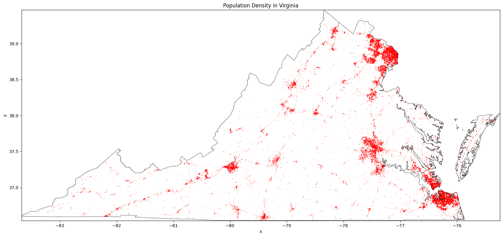

# Local Statistics on Surfaces Using Virginia Population Raster Dataset

More and more spatial data are now available as surfaces, and figuring out how to compute local Moran’s I on them—rather than on geo-tables—is a more advanced topic in geographic data science. Since LISA for surfaces is still experimental and not as developed as for geo-tables, it’s a newer and evolving area. Next, we’ll dive in by using the Virginia population raster to explore its spatial patterns with Local Indicators of Spatial Association (LISAs).

Local statistics are essential tools in geographic data science. When used correctly, they help analyze and visualize the patterns in geographic data. The Local Moran’s I statistic measures how observations relate to their nearby values. Mastering local statistics is crucial for any geographic data scientist, as they are often the first step in many analyses.

